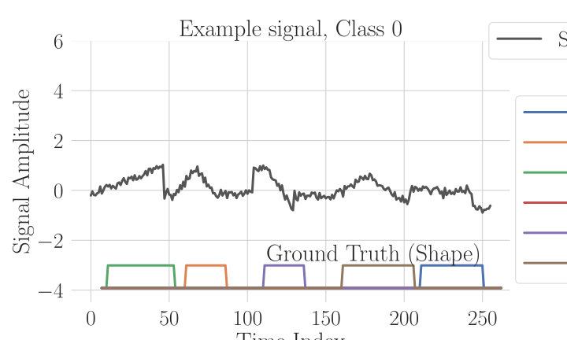

## PGPM - Synthetic Signal Generation

**Version 3.5**

This repository contains _Python_ code that can be used to draw signals from the piecewise Gaussian process model described in DSP2025 paper _A Piecewise Gaussian Process Model for Evaluating Training and Performance of Time-Series Pipelines_. The code here is slightly more general than that used to present the paper, but parameter settings can be adjusted to reproduce the same results (to within finding the seed for the PRNG).

The signal model was initially used to develop both the architecture and training strategy for deep networks that consumed time-series and provided a dense labelling of the temporal axis according to the nature of the activity occurring within an interval of time. 

![An example of one signal, together with its ground truth, constructed through sequential sampling. The ground truth can be represented in different ways: by a single channel containing zero where there is no active shape, or integer values of 1 to 5 for the samples where the relevant shape is active. The other representation is to incorporate 6 channels -- one for each class -- which contain values of zero or 1, 1 at the sample locations (intervals) where an appropriate class is present. Ground truth in this way, by assumption, would only allow one channel to be "hot" at any particular time sample in the ground truth. However, for a network that is uncertain of the nature of the signal at any point in time, we might expect multiple channels to be non-zero.](./Figures/signalshapedemo.svg)





The material focusses on interpreting and conveying the nature of this simple model. We have found the signals useful in a number of projects in which the goal is to test time-series labelling. It should be seen as a providing "test signals" as used in engineering to characterise the input/output mappings of engineered systems. Unlike many techniques that depend on impulse responses, input sine-waves, or noise sources, the form of the discrete-time signals generated by this code are finite support, and inspired by test signals from electrical engineering. They may be of particular use in:

 - Regression testing for deep deep networks that perform dense temporal segmentation.

 - Testing of interpretability techniques for whole (temporal)-axis signal classifiers, since ground truth can be specified.

 - Systematic studies of noise-robustness for either classification or dense segmentation techniques. 

## Notebook
The _Jupyter_ notebook here entitled ```Demo``` reproduces many of the graphs used in the paper (again, seeds are not recorded or set for the PRNG, but you'll get similar results).

## Installation
This is a relatively undemanding installation. The model itself makes use of ``PyTorch`` because the generator can be used in a manner similar to a dataloader, where files would be loaded from disk. However, signals are easily generated on the fly.

## Statistical Model
The model is simply described as somewhat similar in spirit to a Gaussian process. For a discrete-time signal, indexed by time-linked variable, $k$,
 
$s(k) ~ f_s(k|\mathcal{M}), k= 0,1,2,..K-1$
 
and the distribution for additive white-noise is:
$f_s(k) = \mathcal{N}(\mu(k); \sigma)$
 
with coloured noise being:
$f_s(k) = \mathcal{N}(\mu(k); \Sigma)$
where $\Sigma$ is the covariance matrix of additive coloured noise. For example, such noise can be generated by a first-order autoregressive process, or by running a white noise through a band-pass filter.
 

## Model $\mathcal{M}$
The model of individual temporal structures reflects non-overlapping waveforms of finite temporal support, each taking a different shape. Each waveform is characterised by a small number of parameters, such as amplitude, duration, and frequency. Waveform shapes are similar in spirit to 2D shapes, but the 'shape' in this case refers to the temporal evolution (local autocorrelation structure) of the signal, and these are restricted to a small number of forms:
  - a one-sided ramp,
  - a symmetric up/down ramp,
  - a square wave and
  - two oscillatory waves
 
Those familiar with _signal generators_ will recognise the obvious parallels, where characteristic temporal shapes, such as these, are used as 'test signals' to measure the fidelity of a signal processing system.
 
![In addition to semantic temporal segmentation, the signals are also given one of two classes, which apply to each whole signal, but where the class differences are localised. The classes are distinguished by having two different frequency distributions associated with the cosine waveform; these 2 classes are not fully separable, but are well-separable. The classes also have different amplitude distributions for the square wave, allowing the development of techniques to probe saliency measures, and also approaches to training classifiers which are specific to, or ignorant of, amplitude distributions.](./Figures/CosFreqDist.svg)
 
## Noise Model
So far, the noise model given by the fact that this is a normal Gaussian distribution around a sequential sampling process to select and set parameters of the model. The noise model is easily converted into one with a non-trivial covariance structure, by running white-noise into a linear or band-pass filter and adding the resultant to the signal.
 
## Pseudo-Code for Signal Generation
The signal generation process can be summarised in pseudo-code, which is presented in the DSP 2025 Conference paper (Anil A Bharath, _A Piecewise Gaussian Process Model for Evaluating Training and Performance of Time-Series Pipelines_, 2025.)

## TO DO

 0. Include dense segmentation training

 1. Add in baseline drift modelling/trends
    
 2. Turn shape waveforms into generalised functions

 3. Include multiplicative gain variations
 
---
